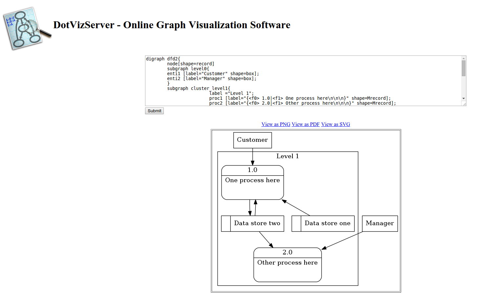

# dotviz-server
WebBased DOT language visualization tool

# Description

http://www.graphviz.org/doc/info/command.html

# How to RUN:

docker run -d -it -p 1234:1234 --name dotviz-server sc0rp1us/dotviz-server

# How to build own assembly:

docker build --rm -t local/dotviz-server .
docker run -d -it -p 1234:1234 --name dotviz-server local/dotviz-server

# Screenshot

